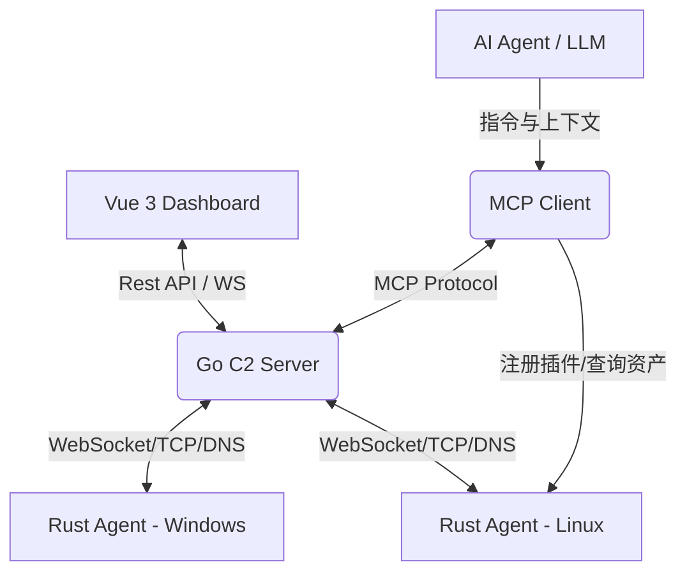

# 🧁 【AI赋能】新时代C2反连平台 (Cupcake C2)

<p align="center">
  
</p>

<p align="center">
  <strong>一款基于 Rust + Go + Vue 3 构建的跨平台高性能 Command & Control (C2) 架构系统。</strong>
</p>

<p align="center">
  
  
  
  
</p>

---

## 📖 目录
- [🌟 项目简介](#-项目简介)
- [📝 作者自述](#-作者自述)
- [✨ 核心特性](#-核心特性)
- [🏗 系统架构](#-系统架构)
- [🛠 技术栈](#-技术栈)
- [🚀 快速开始](#-快速开始)
- [🤖 MCP 智能化协同](#-mcp-智能化协同)
- [🧩 Wasm 插件生态](#-wasm-插件生态)
- [📈 项目进度](#-项目进度)
- [🛡 免杀性能](#-免杀性能)
- [⚠️ 免责声明](#-免责声明)

---

## 🌟 项目简介

**Cupcake** 旨在为安全研究人员提供一个现代、轻量且高度扩展的远控平台。系统通过 Rust 编写极小化的 Client 端（Agent），配合高性能的 Go 语言后端和清爽的 Vue 3 前端，实现了高效的指令下发、文件传输以及 **下一代 Wasm 隐身武器库**。

## 📝 作者自述

> 这是一个追求 **“极致 AI 赋能”** 的 C2 平台。虽然在实现过程中深度使用了 AI 辅助开发，但其核心价值在于 **AI 协同执行** 的架构设计。
>
> **设计哲学：**
> 1.  **全协议覆盖**：目前支持 WS/TCP/DNS，未来将持续扩展更多隐蔽协议。
> 2.  **插件化武器库 (Skill Arsenal)**：
>     *   采用 **WebAssembly (Wasm)** 技术，所有渗透工具（如扫描器、BloodHound 采集器）均以 Wasm 模块形式下发。
>     *   **双层绝缘**：Wasm 字节码天然免杀 + 动态哈希 API 调用，实现**零文件落地**与**R3层隐身**。
> 3.  **AI 副驾驶 (MCP 2.0)**：深度融合 **MCP (Model Context Protocol)**。
>     *   **Intranet Commander**：AI 拥有内网审计指挥官 Skill，自动进行基线检查与风险评估。
>     *   **Wasm Architect**：AI 拥有插件开发架构师 Skill，能现场编写、编译并热加载新的渗透插件。
>
> **初衷：** 既然 AI 已经改变了编码，那它也必将重塑攻防对抗。能交给 AI 做的，绝不重复造轮子。（作者小Tiamo在这里吹个牛，实际上也是为了能偷偷懒）

---

## ✨ 核心特性

- 🖥 **White Angel UI**: 基于 Element Plus 定制的极简靛蓝美学设计，告别传统 C2 的沉重感，提供顺滑的操作体验。
- 🦀 **Rust Agent**: 受控端采用 Rust 编写，无运行时依赖，内存占用极低，支持各种架构交叉编译。
- 🚀 **不落地执行 (Fileless)**:
  - **Execute-Assembly**: 内存反射加载 C# .NET 程序集。
  - **Memfd-Exec**: Linux 匿名内存执行，规避文件落地检测。
  - **Wasm-Skills**: 下一代内存插件体系，比反射 DLL 更轻量、更隐蔽。
- 📦 **Payload Arsenal**: 插件动态上传、Manifest 自动注册，支持快速集成自定义武器。
- 🤖 **MCP 驱动**: 内置 MCP 协议支持，允许 AI（如 Claude/GPT/Cursor）直接调用 C2 接口执行自动化任务。

---

## 🏗 系统架构



---

## 🛠 技术栈

| 模块 | 技术实现 | 作用 |
| :--- | :--- | :--- |
| **Server** | Golang (Gin / GORM) | 核心调度、API 服务、任务队列 |
| **Frontend** | Vue 3 / Vite / Element Plus | 全局操作面板、实时日志监控 |
| **Agent** | Rust / Tokio / Wasmi | 高性能异步受控端逻辑 + Wasm 虚拟机 |
| **Arsenal**| Rust (no_std) -> Wasm | 跨平台、隐身渗透插件 (FScan/BloodHound) |
| **Database** | SQLite | 任务历史与 Agent 状态持久化 |

---

## 🚀 快速开始

> **提示**：目前 Windows 环境仅支持构建 EXE 模板，而 Linux 环境支持一键构建全平台模板。您可以直接下载预编译好的模板放到 `/server/assets` 目录下，直接通过“二进制补丁”模式使用（小Tiamo已经为您准备了一些预填模板）。

### 1. Linux 环境（推荐）

```bash
unzip Cupcake.zip
chmod +x run_linux.sh 
./run_linux.sh
# 脚本会自动安装 Go/Rust 环境，编译 Donut，并启动服务端
```

### 2. Windows 环境

1. **构建前端**：
   ```powershell
   cd server/frontend-v2
   npm install; npm run build
   ```
2. **启动后端**：
   ```powershell
   cd ..
   go run .
   ```

---

## 🤖 MCP 智能化协同

1.  **AI 角色挂载**：
    *   **架构师 (Architect)**：让 AI 读取 `Skills/cupcake-wasm-architect/SKILL.md`，它就能通过 `register_wasm_plugin` 工具现场为你写代码。
    *   **指挥官 (Commander)**：让 AI 读取 `Skills/intranet-commander/SKILL.md`，它就能指导你进行合规的内网审计。
2.  **配置**：修改 `./MCPClient/client.py` 中的 `C2_SERVER` 和 `API_TOKEN`。

---

## 🧩 Wasm 插件生态

目前核心仓库 (Skills) 已包含以下能力：

| 插件名称 | 对应的经典工具 | 功能描述 |
| :--- | :--- | :--- |
| `ws-fscan` | **FScan** | 全内网自动化扫描、Web 指纹识别、Redis/MS17-010 等漏洞探测 |
| `ws-netscan` | **NetSpy** | 极速端口发现，智能跳过非存活网段 |
| `ws-bloodhound` | **SharpHound** | 域环境（AD）隐身侦察，识别域控与登录服务器 |
| `system_guard_scan` | **AV/EDR Checker** | 识别受控端安全软件类型 |

---

## 📈 项目进度

- [x] **TCP 协议** (100%): 稳定通信。
- [x] **WebSocket 协议** (100%): 支持伪交互式终端。
- [x] **Wasm 虚拟机** (100%): 完整支持 Host Call 双向通信。
- [ ] **DNS 协议** (70%): 测试中。
- [ ] **隧道技术** (50%): Socks5 基础实现。

---

## 🛡 免杀性能

> **免杀心得**：实测发现，Windows 原生环境下编译的模板，其免杀效果通常优于跨平台交叉编译。项目集成了源码混淆，建议开发环境与目标环境尽量保持一致（即 Windows 编 Windows，Linux 编 Linux）。

- **静态扫描**：VirScan 全绿通过。
- **Wasm 隐身**：Wasm 插件由内存加载，完全无文件落地，且 API 调用经过动态哈希混淆，可绕过绝大多数 EDR 行为监测。

---

## ⚠️ 免责声明

本工具仅限于合法授权的渗透测试、安全审计及教育目的使用。使用者应遵守当地法律法规，因使用本工具导致的任何直接或间接后果均由使用者自行承担，开发者不承担任何责任。

---

<p align="center">
  Made with ❤️ by <strong>Tiamo</strong>
</p>
