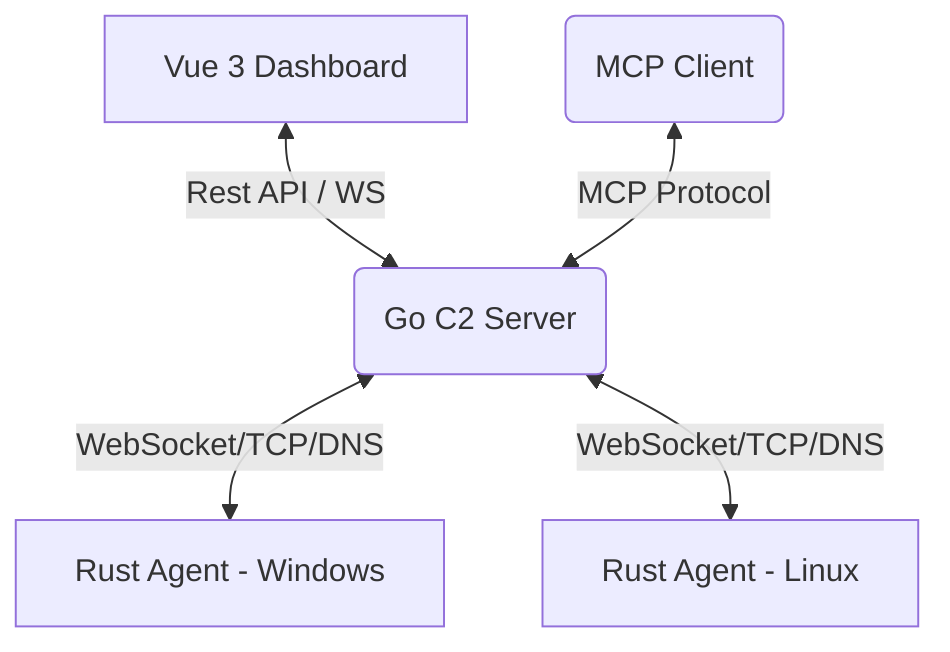

# 🧁 Cupcake C2 Demo

<p align="center">
  
</p>


<p align="center">
  <strong>一款基于 Rust + Go + Vue 3 构建的跨平台高性能 Command & Control (C2) 架构系统。</strong>
</p>


<p align="center">
  
  
  
  
</p>


---

## 📖 目录

- [🌟 项目简介](#-项目简介)
- [📝 作者自述](#-作者自述)
- [✨ 核心特性](#-核心特性)
- [🏗 系统架构](#-系统架构)
- [🛠 技术栈](#-技术栈)
- [🚀 快速开始](#-快速开始)
- [🤖 MCP 自动化配置](#-mcp-自动化配置)
- [📈 项目进度](#-项目进度)
- [🛡 免杀性能](#-免杀性能)
- [⚠️ 免责声明](#-免责声明)

---

## 🌟 项目简介

**Cupcake** 旨在为安全研究人员提供一个现代、轻量且高度扩展的远控平台。系统通过 Rust 编写极小化的 Client 端（Agent），配合高性能的 Go 语言后端和清爽的 Vue 3 前端，实现了高效的指令下发、文件传输以及复杂的“不落地”武器库执行能力。


## 📝 作者自述

> 这是一个追求 **“极致 AI 赋能”** 的 C2 平台。虽然在实现过程中深度使用了 AI 辅助开发，但其核心价值在于 **AI 协同执行** 的架构设计。
>
> **设计哲学：**
>
> 1. **全协议覆盖**：目前支持 WS/TCP/DNS，未来将持续扩展更多隐蔽协议。
> 2. **插件化武器库**：采用模块化设计，支持功能动态扩展，实现热插拔。
> 3. **AI 副驾驶**：深度融合 **MCP (Model Context Protocol)**，让 AI 助手直接介入后渗透阶段。AI 不仅仅是聊天工具，而是能帮你分析环境、尝试提权、辅助决策的“现场指挥官”。
>
> **初衷：** 既然 AI 已经改变了编码，那它也必将重塑攻防对抗。能交给 AI 做的，绝不重复造轮子。（作者小Tiamo搁着吹牛呢）

---

## ✨ 核心特性

- 🖥 **White Angel UI**: 基于 Element Plus 定制的极简靛蓝美学设计，告别传统 C2 的沉重感，提供顺滑的操作体验。
- 🦀 **Rust Agent**: 受控端采用 Rust 编写，无运行时依赖，内存占用极低，支持各种架构交叉编译。
- 🚀 **不落地执行 (Fileless)**:
  - **Execute-Assembly**: 内存反射加载 C# .NET 程序集。
  - **Memfd-Exec**: Linux 匿名内存执行，规避文件落地检测。
  - **Shellcode-Injection**: 支持远程线程注入及 Shellcode 动态分发。
- 📦 **Payload Arsenal**: 插件动态上传、Manifest 自动注册，支持快速集成自定义武器。
- 🤖 **MCP 驱动**: 内置 MCP 协议支持，允许 AI（如 Claude/GPT/Cursor）直接调用 C2 接口执行自动化任务。

---

## 🏗 系统架构



---

## 🛠 技术栈

| 模块         | 技术实现                    | 作用                         |
| :----------- | :-------------------------- | :--------------------------- |
| **Server**   | Golang (Gin / GORM)         | 核心调度、API 服务、任务队列 |
| **Frontend** | Vue 3 / Vite / Element Plus | 全局操作面板、实时日志监控   |
| **Agent**    | Rust / Tokio                | 高性能异步受控端逻辑         |
| **Database** | SQLite                      | 任务历史与 Agent 状态持久化  |

---

## 🚀 快速开始

> windows没有一键构建所有模板的脚本，但是linux有一键构建所有模板的脚本，windows只有构建exe的脚本，可以选择下载编译好的模板放到 `/server/assets` 目录下，之后便可在 Web 端使用“二进制补丁”模式快速生成 Payload。(小Tiamo放了作者编译的模板)

### 1. Linux 环境（推荐）

项目提供了一键启动脚本，可自动检测并安装所需的 Go (1.25.x) 和 Rust 环境。

```bash
# 解压项目
unzip Cupcake.zip
# 赋予执行权限
chmod +x run_linux.sh 
# 启动环境检测与运行
./run_linux.sh
```

> **提示**：脚本会自动处理依赖。启动后，默认管理台端口为 `9999`。

### 2. Windows 环境

手动编译流程：

1. **构建前端**：

   ```bash
   cd server/frontend-v2
   npm install && npm run build
   ```

2. **启动后端**：

   ```bash
   cd ../
   go run .
   ```

### 3. 构建模式说明

Cupcake 提供两种 Payload 生成模式：

- **源码编译模式**：实时根据配置编译 Rust 源码，隐蔽性最强。
- **二进制填充模式 (Patch)**：基于预编译的 `assets` 模板进行配置注入，生成速度极快（几毫秒内）。

---

## 🤖 MCP 自动化配置

通过 MCP 协议，你可以让 AI 成为你的渗透助手：

1. **获取 Token**：启动 Server 后，终端会打印出生成的随机 32 位 `API_TOKEN`。
2. **配置客户端**：
   修改 `./MCPClient/client.py` 中的配置：
   - `C2_SERVER`: 填入你的服务器地址。
   - `API_TOKEN`: 填入上述获取的令牌。
3. **协同模式**：你可以通过支持 MCP 的 IDE 或工具直接与 C2 交互。

---

## 📈 项目进度

- [x] **TCP 协议** (100%): 稳定通信。
- [x] **WebSocket 协议** (100%): 支持伪交互式终端。
- [ ] **DNS 协议** (70%): 框架已完成，可用性测试中。
- [ ] **隧道技术** (50%): Socks5/HTTP 隧道基础实现，待优化。
- [ ] **DoH / DoT / UDP**: 规划中。

---

## 🛡 免杀性能

> 静态免杀方面，Windows 原生编译的效果优于交叉编译。项目中集成了源码级随机化补丁，建议用户根据实际环境调整混淆参数。（人话：就是windwos编译windwos的模板，linux编译linux的模板效果更好。）

- **静态扫描**：VirScan 全绿通过。

- **动态监测**：火绒、360 实时监控下常规操作不报毒。

- **优化建议**：对于 Linux 交叉编译出的 Windows EXE，建议手动运行一次 `generate_templates.sh` 以生成最新的混淆模板。


---

## ⚠️ 免责声明

本工具仅限于合法授权的渗透测试、安全审计及教育目的使用。严禁将其用于任何非法活动。使用者在使用本工具时应遵守当地法律法规，因使用本工具导致的任何直接或间接后果均由使用者自行承担，开发者不承担任何责任。
本工具仅限于合法授权的渗透测试、安全审计及教育目的使用。严禁将其用于任何非法活动。使用者在使用本工具时应遵守当地法律法规，因使用本工具导致的任何直接或间接后果均由使用者自行承担，开发者不承担任何责任。
本工具仅限于合法授权的渗透测试、安全审计及教育目的使用。严禁将其用于任何非法活动。使用者在使用本工具时应遵守当地法律法规，因使用本工具导致的任何直接或间接后果均由使用者自行承担，开发者不承担任何责任。

---

<p align="center">
  Made with ❤️ by <strong>Tiamo</strong>
</p>

